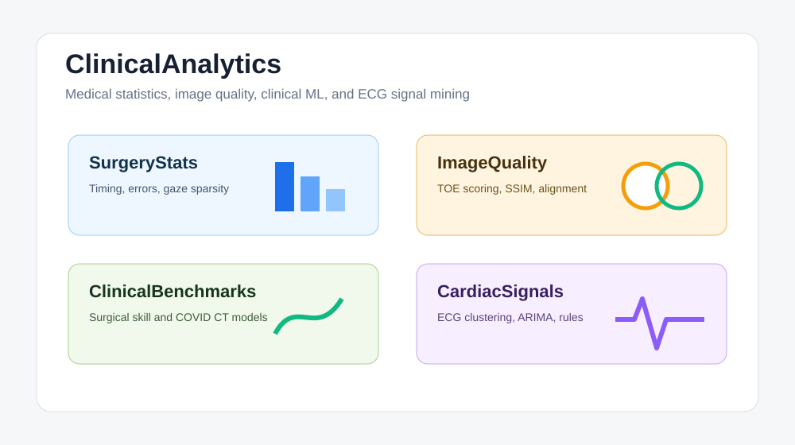

# ClinicalAnalytics

[中文](README.md)

ClinicalAnalytics is a compact medical data-science collection split into independent, function-named projects. Original submission archives are retained under `archive/` for traceability.



## Results

| Showcase item | Current result | Notes |
| --- | --- | --- |
| Subprojects | 4 | Statistical testing, image quality, clinical ML, and ECG time series |
| Fully runnable data | `ImageQuality` | Includes `.mat` data and a one-command script |
| No-data summaries | `SurgeryStats`, `ClinicalBenchmarks` | Keeps summary outputs and method notes available |
| Lightweight verification | 6 structure tests | Checks entry points, READMEs, scripts, and naming consistency |

## Core Features

- Splits four medical data projects into independent units covering statistical testing, image quality, classical ML, and ECG time-series analysis.
- Keeps summary scripts and result tables for projects whose original datasets are not bundled, so the repository remains reviewable.
- Includes structure tests for README coverage, script entry points, and function-based naming across the collection.

## Reproducibility Boundaries

- `ImageQuality` includes its `.mat` dataset and can run end-to-end after dependency installation.
- `SurgeryStats`, `ClinicalBenchmarks`, and `CardiacSignals` retain notebooks/reports/scripts, but some original datasets are not distributed.
- CI uses structure tests and shell syntax checks rather than private datasets.

| Project | Focus | Quick command |
| --- | --- | --- |
| `SurgeryStats` | Surgical timing, error, and gaze/fixation statistics | `bash scripts/run_summary.sh` |
| `ImageQuality` | TOE image-quality scoring, similarity metrics, and alignment analysis | `bash scripts/run_all.sh` |
| `ClinicalBenchmarks` | Surgical-motion skill classification and COVID CT feature classifiers | `bash scripts/run_summary.sh` |
| `CardiacSignals` | ECG clustering, ARIMA forecasting, and heart-disease association rules | `bash scripts/run_question.sh q1` |

## Quick Start Index

| Need | Start here |
| --- | --- |
| Fastest no-data summary | `cd SurgeryStats && conda run -n codex_python bash scripts/run_summary.sh` |
| Included-dataset full run | `cd ImageQuality && bash scripts/setup_env.sh && bash scripts/run_all.sh` |
| Clinical benchmark metrics | `cd ClinicalBenchmarks && conda run -n codex_python bash scripts/run_summary.sh` |
| ECG question scripts | `cd CardiacSignals && bash scripts/run_question.sh q1` |
| Structural tests | `conda run -n codex_python pytest tests/ -q` |

## Shared Python Environment

Each subproject setup script can install into an active conda environment, while retaining a `.venv` fallback for fresh clones. For example:

```bash
cd SurgeryStats
conda run -n codex_python bash scripts/run_summary.sh
```

## Notes

- `ImageQuality` includes its `.mat` dataset and can run after dependency installation.
- `SurgeryStats`, `ClinicalBenchmarks`, and `CardiacSignals` retain notebooks/reports and scripts, but some source datasets are not bundled.
- Each subfolder has its own README, dependency file, and script entry point.
